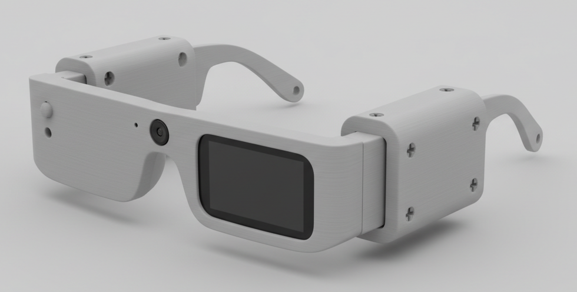

# Nisaetus

<p align="center">
  
</p>

Real-time AI vision and voice assistant through HeyCyan Smart Glasses, powered by [Pepebot](https://github.com/pepebot-space/pepebot) Live API.

Nisaetus connects to HeyCyan smart glasses via BLE, streams microphone audio directly from the glasses (OPUS via BLE), captures AI photo thumbnails from the glasses camera (JPEG via BLE), and plays back AI responses through the local speaker — enabling fully wireless, hands-free AI interaction through smart glasses.

## How It Works

```
┌──────────────────────┐         BLE          ┌──────────────┐   WebSocket   ┌─────────────┐
│   HeyCyan Glasses    │◄────────────────────►│   Nisaetus   │◄─────────────►│   Pepebot   │
│                      │                       │   (Python)   │               │  Live API   │
│  📷 Camera           │──── JPEG thumbnail ──►│              │               │  (Gemini)   │
│  🎤 Mic (OPUS BLE)   │──── audio stream ────►│              │               └─────────────┘
│  🔊 Speaker          │                       │              │
│                      │◄─── commands ─────────│              │
└──────────────────────┘                       └──────────────┘
```

1. **Mic** — Glasses streams OPUS audio via BLE (`cmd=0x59`), decoded to PCM 16kHz and sent to Pepebot
2. **Camera** — AI photo thumbnail captured on glasses, sent as JPEG via BLE (`cmd=0xFD`), forwarded to Pepebot as video frames
3. **Pepebot Live API** — PCM audio + JPEG frames streamed over WebSocket to Gemini Live for real-time multimodal AI
4. **Speaker** — AI audio responses (PCM 24kHz) played back through local speaker

## Device Compatibility

Tested on **HeyCyan M02S / A02S** (`M02S_D1BA`):

| Feature | Status |
|---------|--------|
| BLE scan & connect | Working |
| Battery query | Working |
| Take photo | Working |
| Find device (beep) | Working |
| AI photo + thumbnail via BLE | Working |
| Mic audio stream (OPUS BLE) | Working |
| WiFi transfer | Not supported on macOS (WiFi Direct / P2P) |

## Requirements

- Python 3.11 or 3.12
- [Poetry](https://python-poetry.org/)
- Bluetooth Low Energy adapter
- [Pepebot](https://github.com/pepebot-space/pepebot) gateway running with `live.enabled=true`
- PortAudio (`brew install portaudio` on macOS)

## Install

```bash
git clone git@github.com:pepebot-space/nisaetus.git
cd nisaetus
brew install portaudio  # macOS
poetry install
```

## Usage

```bash
# Default: glasses mic (OPUS BLE) + AI photo thumbnails + local speaker
poetry run nisaetus

# Connect directly by BLE address (skip scan)
poetry run nisaetus --address AA:BB:CC:DD:EE:FF

# Local mic only (no glasses)
poetry run nisaetus --mode local

# Hybrid: glasses camera thumbnails + local mic
poetry run nisaetus --mode hybrid

# Custom Pepebot URL
poetry run nisaetus --url ws://192.168.1.100:18790/v1/live

# Debug logging
poetry run nisaetus -v
```

### Modes

| Mode | Camera | Microphone | Speaker |
|------|--------|------------|---------|
| `glasses` | Glasses (JPEG via BLE) | Glasses mic (OPUS via BLE) | Local speaker |
| `hybrid` | Glasses (JPEG via BLE) | Local mic | Local speaker |
| `local` | None | Local mic | Local speaker |

> **Note:** In `glasses` mode, camera (AI photo) and mic (speech recognition) cannot run simultaneously — they are separate glasses modes. The mic stream takes priority.

## Project Structure

```
nisaetus/
├── __init__.py
├── protocol.py         # BLE protocol: packet framing, CRC16, command IDs, enums
├── glasses.py          # HeyCyan BLE client: scan, connect, commands, audio/thumbnail streaming
├── wifi_transfer.py    # HTTP media download from glasses hotspot (Android/WiFi Direct only)
├── live_client.py      # Pepebot Live API WebSocket integration
└── cli.py              # CLI entry point
assets/
└── glass.png           # Device image
scripts/
└── test_glasses.py     # Standalone test script for glasses commands
ARCHITECTURE.md         # Full protocol documentation & debugging guide
```

## BLE Protocol

Reverse-engineered by decompiling the Android `glasses_sdk_20250723_v01.aar` (oudmon BLE library). See [ARCHITECTURE.md](ARCHITECTURE.md) for full details.

### Active Channels

| Channel | Service | Write | Notify | Purpose |
|---------|---------|-------|--------|---------|
| Serial Port | `de5bf728-...` | `de5bf72a` | `de5bf729` | All commands, responses, audio, thumbnails |
| Small Data | `6e40fff0-...` | `6e400002` | `6e400003` | 16-byte fixed packets (unused) |

> The `ae01/ae02` channel (oudmon UART) echoes all data without processing — not used.

### Packet Format

```
[0xBC] [cmd_id] [len_lo] [len_hi] [crc16_lo] [crc16_hi] [payload...]
```

CRC16/MODBUS over payload. Packets > 244 bytes are fragmented.

### Key Commands (cmd 0x41 — Glasses Control)

| Command | Payload | Description |
|---------|---------|-------------|
| Take photo | `02 01 01` | Capture photo |
| Start video | `02 01 02` | Start recording |
| AI photo | `02 01 06 02 02 02` | AI capture + thumbnail |
| Speech recognition | `02 01 07` | Start mic stream (OPUS via BLE) |
| Find device | `02 01 0D` | Beep/flash |
| Speaker start | `02 01 10` | Start voice playback |
| WiFi transfer | `02 01 04` | Enable WiFi P2P hotspot |

### Mic Audio Stream (cmd 0x59)

When speech recognition mode is active, the glasses stream OPUS audio:

- **40 bytes/packet**, ~48 packets/second
- **Codec:** OPUS, 16kHz mono, ~20ms frames
- **Decode:** `opuslib.Decoder(16000, 1).decode(frame, 320)`
- Glasses auto-stop after ~5s silence; Nisaetus auto-restarts

### AI Photo Thumbnail (cmd 0xFD)

```
take_ai_photo()  →  wait cmd=0x73 (photo ready)  →  request cmd=0xFD  →  receive JPEG ~1KB
```

## License

MIT
